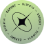
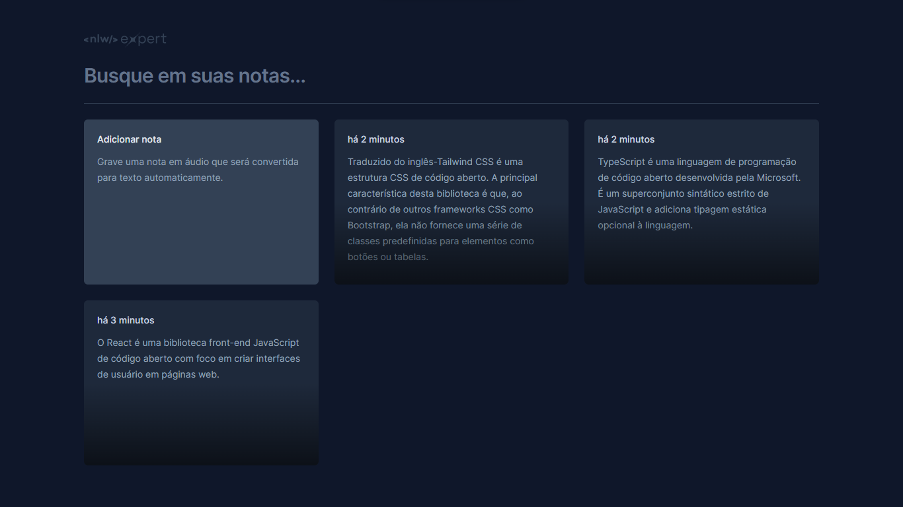

<h1 align="center" style="text-align: center;">
  
  Expert Notes
</h1>

> Projeto desenvolvido na Trilha React da NLW Expert da Rocketseat.

<p align="center">
  <a href="#project">Projeto</a>&nbsp;&nbsp;&nbsp;|&nbsp;&nbsp;&nbsp;
  <a href="#technologies">Tecnologias</a>&nbsp;&nbsp;&nbsp;|&nbsp;&nbsp;&nbsp;
  <a href="#usage">Utilização</a>&nbsp;&nbsp;&nbsp;|&nbsp;&nbsp;&nbsp;
  <a href="#license">Licença</a>
</p>

<p align="center">
  
</p>

<h2 id="project">📁 Projeto</h2>

Aplicação de notas de áudio que se convertem em texto.



[🔗 Acesse aqui](https://nlw-expert-notes-e83533.netlify.app/)

<h2 id="technologies">💻 Tecnologias</h2>

Este projeto foi desenvolvido utilizando tecnologias como:

- React e React-DOM
- Date-fns
- Tailwind CSS
- TypeScript
- Vite
- PostCSS
- Radix UI
- Lucide-react
- Sonner
- SpeechRecognition

<h2 id="usage">💡 Utilização</h2>

Para executar a aplicação em sua máquina localmente, certifique-se de ter o `Node.js` e o `npm` instalados antes de prosseguir com as etapas abaixo:

1. Clone o projeto:

```
$ git clone https://github.com/madalena-rocha/nlw-expert
```

2. Acesse a pasta do projeto:

```
$ cd nlw-expert
```

3. Instale as dependências:

```
$ npm install
```

4. Inicie o servidor:

```
$ npm run dev
```

<h2 id="license">📝 Licença</h2>

Este projeto está sob a licença MIT.

---

Feito com 💜 by Madalena 👋🏾

<div style="display: flex;">
  <a href="https://www.linkedin.com/in/madalena-machado-rocha/" target="_blank"></a>
  <a href="mailto:rochamada1997m@gmail.com"></a>
  <a href="http://discordapp.com/users/827312692905377802" target="_blank"></a>
  <a href="https://www.instagram.com/madalena.machado.rocha/" target="_blank"></a>
</div>